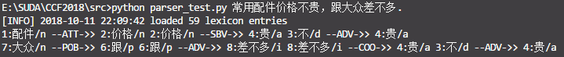
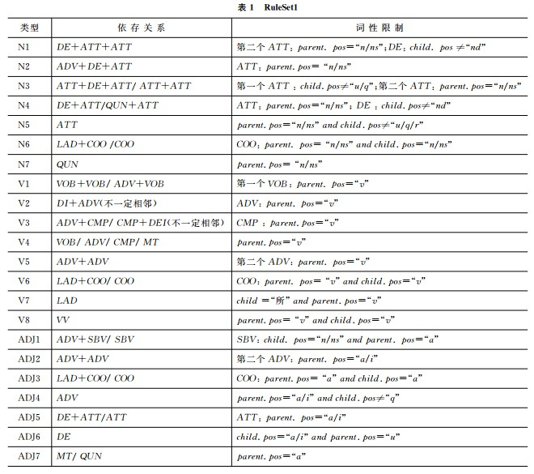

# CCF BDCI 2018 汽车行业用户观点主题及情感识别 比赛试水

--------
<!-- TOC -->

- [CCF BDCI 2018 汽车行业用户观点主题及情感识别 比赛试水](#ccf-bdci-2018-汽车行业用户观点主题及情感识别-比赛试水)
    - [数据分析](#数据分析)
    - [解决方案](#解决方案)
        - [方案一：文本分类法](#方案一文本分类法)
        - [方案二: 利用依存句法解决多主题问题](#方案二-利用依存句法解决多主题问题)
    - [文献和参考资料](#文献和参考资料)
    - [Update](#update)

<!-- /TOC -->

---------

## 数据分析

详见`data/analysis`

## 解决方案

### 方案一：文本分类法

由于题目中对情感分析的情感词部分并不做强制性要求，故可简单地把本问题看作为两个文本分类问题。

第一个文本分类问题是关于主题的分类；第二个文本分类问题是关于情感极性的分类。

分别进行分类后得到相应的结果，再将结果拼接即可。

优点是分类速度快且算法复杂度低，开发周期短. 缺点是分类效果差, 对于特定问题缺乏灵活性, 且参数选取繁琐.

目前使用了两个分类器进行分类测试，值得注意的是，目前还未对sentiment_word字段进行有效的应用，且主题分类器和情感分类器之间彼此割裂，分别独立。目前需要解决数据的利用问题和主题与情感割裂的问题。

线上结果如下：
- SVC（RBF核的SVM算法），最终线上测试结果为：`0.35952064000`
- SGD（LinearSVM），最终线上测试结果为：`0.59387480000`
- Baseline(Logistic Regression), 最终线上测试结果为: ` 0.61185086000`

问题解决流程：
1. 文本分词
2. 统计词频
3. 计算TF-IDF矩阵
4. 对上述步骤所产生的矩阵进行分类操作，构建分类器
5. 带入测试集，得到预测结果

### 方案二: 利用依存句法解决多主题问题

由于训练集之中存在一条评论对应多个主题的现象, 如: `森林人的价格很贵, 但是动力很足`, 就存在对`价格`和`动力`两方面的描述. 第一开始想通过BIO序列标注找到情感词对, 但是发现有难度. 这种难度主要是由于序列标注需要大量的数据支撑, 但是现有的数据集在特定领域上的表现并不突出. 所以萌生了利用依存句法来分析句子成分的想法. 

例如: 将`森林人的价格很贵, 但是动力很足`切分为: `森林人/n 的/u 价格/n 很/d 贵/a ,/wp 但是/c 动力/n 很/d 足/a`分析出句子主干: `价格贵`和`动力足`(主谓结构). 或`森林人价格贵`和`森林人动力足`(主谓宾结构). 即可利用该结构得到词对`<森林人, 价格, 贵>`和`<森林人, 动力, 足>`. 再由情感词表查找得出`<森林人, 价格, 贵, -1>`和`<森林人, 动力, 足, 1>`. 这样既简化了句子结构, 又可以分析出多主题问题, 又可将长句化简为短句, 一举多得. 

目前还有很多尚待解决的问题:

- 句法不全都是`主谓宾`结构, 要么通过自行标注强行更改句子结构, 以达到归一化的效果, 要么定义多个规则集
- 否定词的使用

上图所示的第一个版本完成之后, 找到了相关的论文([王素格, 2012](http://jcip.cipsc.org.cn/CN/abstract/abstract1619.shtml)), 论文中提到了如下所示的规则集(节选), 之后会尝试将代码更新至可定制化规则集的版本:

## 文献和参考资料

- 分类工具的使用
   - [libSVM](https://www.csie.ntu.edu.tw/~cjlin/libsvm/)
   - [MaxEnt](https://homepages.inf.ed.ac.uk/lzhang10/maxent.html)
   - [sci-kit learn](http://scikit-learn.org/stable/)
   
- 样本不均衡问题:　南大一位博士写的综述（比较简单）[PDF](http://lamda.nju.edu.cn/liyf/dm14/111220005.pdf)

- 王素格, 吴苏红. 基于依存关系的旅游景点评论的特征-观点对抽取. 中文信息学报. 2012. [link](http://jcip.cipsc.org.cn/CN/abstract/abstract1619.shtml)

- 帮助较大的一些Github仓库
    - [IMDB情感分析-LSTM-tflearn](https://github.com/llSourcell/How_to_do_Sentiment_Analysis)
    - [京东文本分类-SGD-sklearn](https://github.com/stevewyl/keras_text_classification/blob/master/jd/ml_text_classification.py)

## Update
- 2018/10/13 更新依存句法分析的demo和之前的baseline结果
