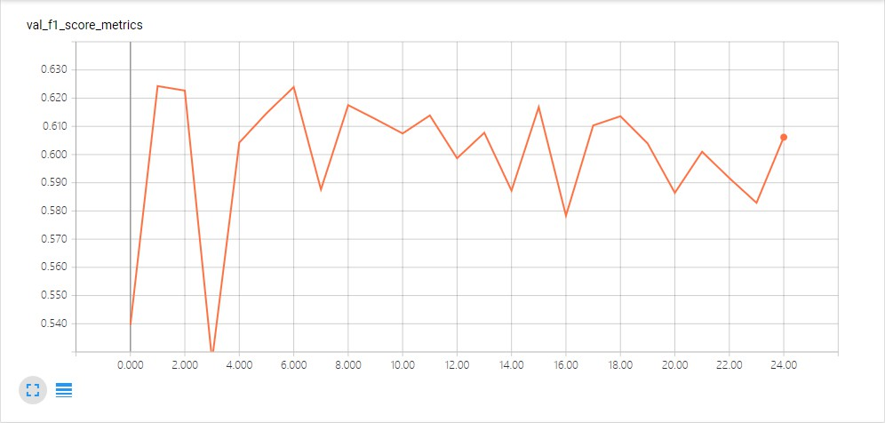
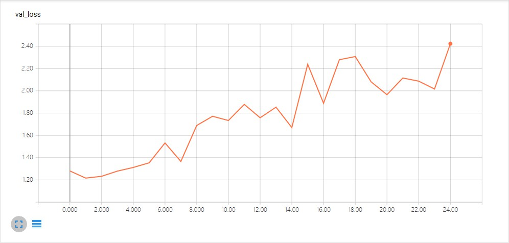

# CCF BDCI 2018 汽车行业用户观点主题及情感识别 实验简报 - 朱桐

<!-- TOC -->

- [CCF BDCI 2018 汽车行业用户观点主题及情感识别 实验简报 - 朱桐](#ccf-bdci-2018-汽车行业用户观点主题及情感识别-实验简报---朱桐)
    - [问题重述](#问题重述)
    - [数据说明](#数据说明)
        - [训练集](#训练集)
        - [测试集](#测试集)
    - [解决方案](#解决方案)
        - [纯分类法](#纯分类法)
        - [句法分析法](#句法分析法)
    - [TODO](#todo)
    - [实验记录](#实验记录)

<!-- /TOC -->

##问题重述

给出多组关于用户对汽车的评价文本，要求分析出该文本对应的主题、情感极性、情感词等信息。

## 数据说明

### 训练集

| 字段            | 简介     |
| --------------- | -------- |
| content_id      | 用户编号 |
| content         | 评价内容 |
| subject         | 评价主题 |
| sentiment_value | 情感值   |
| sentiment_word  | 情感词   |

### 测试集

| 字段       | 简介     |
| ---------- | -------- |
| content_id | 用户编号 |
| content    | 评价内容 |

## 解决方案

### 纯分类法

由于题目中对情感分析的情感词部分并不做强制性要求，故可简单地把本问题看作为两个文本分类问题。

第一个文本分类问题是关于主题的分类；第二个文本分类问题是关于情感极性的分类。

分别进行分类后得到相应的结果，再将结果拼接即可。在这里我使用的是朴素贝叶斯方法（`sklearn.naive_bayes.MultinomialNB`）。

**优点：**

- 分类速度快
- 算法复杂度低，开发周期短

**缺点：**

- **分类效果差** 
- 对于特定问题缺乏灵活性
- 参数选取繁琐

### 句法分析法

句法分析可以从语义上更加贴近实际情况。通过情感词对的提取找到合适的处理方案。

目前的一种思路是将一些特定的描述性实体和对它们的描述提取出来，生成类似如下效果的对象：

```json
{
    "contents": [
    	{
            "content_id": "qwertyui", 
            "sentences": [
                {"sentence": "我觉得价格有点高", "entity": "价格", "sentiment": "高"},
                {"sentence": "舒适度还不错", "entity": "舒适度", "sentiment": "不错"},
            ]
        },
        {
            "content_id": "asddfghghj", 
            "sentences": [
                {"sentence": "性价比不行", "entity": "性价比", "sentiment": "不行"},
                {"sentence": "发动机贼棒", "entity": "发动机", "sentiment": "贼棒"},
            ]
        }
    ]
}
```

目前希望能从依存句法的角度进行分析，但是还没有找到好的方法进行提取，需要查看一些文献。

- 由于情感极性存在0（中立）的情况，还要考虑提取不出相关情感词对的情况，将其视为中立
- 由于存在一条评论中有多个情感极性或多个主题分类的情况，所以要解决分句的问题（e.g. 用户说了两句话，第一句说价格偏高，第二句说舒适度很不错），将不同的句子进行分开处理

## TODO

- [x] `sklearn.model_selection.GridSearchCV`找到合适的算法参数
- [ ] 筛选特征，总结特征工程实施的一般规律
- [ ] 句法分析和情感对的提取
  - [ ] 情感对和情感极性的对应关系
- [ ] 对于同一句子的不同分类、不同情感极性的特点寻找到合适的解决方案


## 实验记录

- 2018/09/06 星期四

  - 下载并分析数据集的特征
  - 从获取到的数据集中我们可以观察出如下的一些特征：
    - 一个`content_id` 有可能对应同一条语句，但是主题不同
    - 一个`content_id`有可能对应同一条语句，但是情感不同

- 2018/09/07 星期五 

    - 编写一些基础的过程函数
    - 使用`pyltp`库进行分词，使用`stop_words.txt` 停词表进行停用词剔除
        - [pyltp工具文档](https://pyltp.readthedocs.io/zh_CN/latest/api.html#id6)
        - [ltp中关于依存句法关系的说明](https://ltp.readthedocs.io/zh_CN/latest/appendix.html#id3)
    - 查看一些相关的博客文章
    - [词向量和语言模型](http://www.licstar.net/archives/328)
    - [分类器模型评价指标](https://blog.csdn.net/guohecang/article/details/52276548)

- 2018/09/08 星期六 得分：0.35619175000

    - 编写分类器方法的代码（Python3）
    - 分类器使用`sklearn.naive_bayes.MultinomialNB`
    - TODO: 分类器暂时使用默认参数，下一步需通过`sklearn.model_selection.GridSearchCV`进行网格搜索，以便参数调优
    - 参考资源
        - [机器之心, 如何通过Scikit-Learn实现多类别文本分类？](https://www.jiqizhixin.com/articles/2018-03-05-3)
        - [Geron, Hands-on-ML-with-Scikitlearn-and-TF-Chapter2](https://github.com/apachecn/hands_on_Ml_with_Sklearn_and_TF/blob/dev/docs/2.%E4%B8%80%E4%B8%AA%E5%AE%8C%E6%95%B4%E7%9A%84%E6%9C%BA%E5%99%A8%E5%AD%A6%E4%B9%A0%E9%A1%B9%E7%9B%AE.md)

    - 注意编码问题：第一次提交时忘了考虑UTF-8编码的问题，直接用了Python文件的默认输出编码（GB2312），之后通过`codecs.open(filename, mode, encoding)` 方法输出了utf-8

- 2018/09/29 星期六 得分：0.35952064000

    - 今天最大的任务就是对之前已经编写好的模型进行了参数优化。主要使用`GridSearch`方法对`SVC`模型进行了简单的寻优。之前已经搭好了`SVC`的分类器，时间有点久远，没进行记录orz，今天主要是进行寻优。
    - 没想到模型耗时这么长，看来RBF核的SVM复杂度很高。
    - 具体参数
        - `GridSearchCV(SVC(), param_grid={"C":[0.1, 0.3, 1, 3, 10], "gamma":[3, 1, 0.1, 0.01]}, cv=10)`
        - `The best parameters are {'C': 3, 'gamma': 0.1} with a score of 0.67`
    - 提升空间有限，且耗时很长。最终的结果与预测结果相差不大。或许是该换一个模型了。
    - 参考资源
        - [GridSearchCV官方文档](http://scikit-learn.org/stable/modules/generated/sklearn.model_selection.GridSearchCV.html)

- 2018/10/03 星期三 得分：0.59387480000

    - 之前查了很多TextCNN分类的代码和博客，收获不大。但是今天在查TextCNN的时候，在作者提供的仓库里发现作者使用了`SGDClassifier`分类器（LinearSVM），并给出了结果测试代码。经测试发现，比之前RBF核的SVM算法线下F1值要高。遂尝试了一下，果然有惊喜！
    - 不过也了解了一下，该分类器使用随机梯度下降法进行最优化，所以速度很快，但是模型较为简单，且提升空间不大。第一判断是无法再进行寻优，除非更改核函数（也就是更改模型了）。
    - 具体参数
        - `SGDClassifier(loss='hinge', penalty='l2', alpha=1e-3, max_iter= 5, random_state=42)` L2正则化，学习率$10^{-3}$
    - 参考资源
        - [京东文本分类-SGD-sklearn](https://github.com/stevewyl/keras_text_classification/blob/master/jd/ml_text_classification.py)

- 2018/10/04 星期四 

    - 今天准备使用keras复现TextCNN
    - 参考资源
        - [Yoon Kim, 2014](https://arxiv.org/abs/1408.5882)

- 2018/10/07 星期日

    - 今天对一些神经网络模型进行了简单的复现
    - 模型：MLP、单层LSTM、TextInception ([Chen Yun, 2017](https://zhuanlan.zhihu.com/p/28923961))
    - 过拟合非常严重：利用Chen的方法，在经过25个epoch之后，验证的`F1`和`loss`分别如下图所示
    
    
    - 解决方案
        - 尝试使用`gensim`库的`word2vec`词向量重新表示
        但是词向量的训练结果并不令人满意。e.g.与价格最接近的几个词：
        ```python
        # 从直观印象上来看，结果很不好，并且在语义上并不接近
        # 可能是Word2Vec训练参数有问题
        [
            ('sti', 0.9968149662017822), 
            ('就别', 0.9960107207298279), 
            ('丰富', 0.995136559009552), 
            ('es', 0.9951053261756897), 
            ('懂车', 0.9950652718544006), 
            ('各有所爱', 0.9941401481628418), 
            ('店内', 0.9938971400260925), 
            ('吓人', 0.9938815236091614), 
            ('科迪亚克', 0.9938446879386902), 
            ('劝', 0.9936362504959106)
        ]
        ```
        - 下一步将尝试使用情感词典发掘情感词对
            - [关于情感分析的工具-知乎](https://www.zhihu.com/question/20631050)
            里面提到了SnowNLP，但是使用类似的工具和直接调用百度API有啥区别，囧。。。
            - [情感词汇本体-大连理工大学](http://ir.dlut.edu.cn/EmotionOntologyDownload/)
            大工的这个工具大概看了下，发现里面有“优惠”，没有“便宜”，词汇虽然有近3W个，但还是不全。
            - [HowNet](http://www.keenage.com)
            官网没备案，现在进不去，囧。补一个简介：[在深度学习时代用HowNet搞事情-刘知远](https://zhuanlan.zhihu.com/p/32688983)